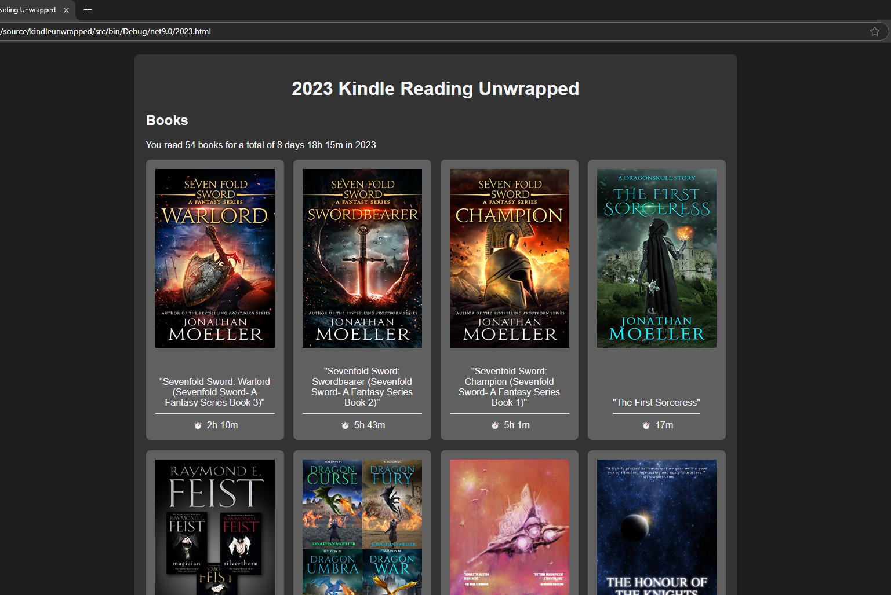
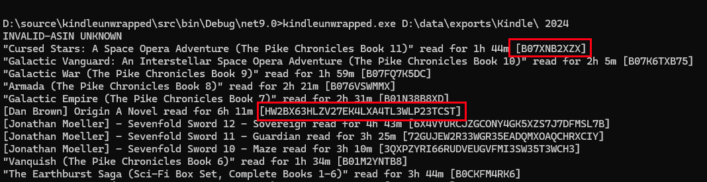

## Introduction

kindleunwrapped is a command-line tool that reads information from a Kindle data export and produces a webpage showing book read and time spent.



A Kindle data export can be requested from Amazon by visiting the 'Request your data' page, e.g. https://www.amazon.co.uk/hz/privacy-central/data-requests/preview.html and selecting the Kindle option.

## Usage

Unzip the kindle data export to a directory then run:

`kindleunwrapped kindleexportdirectory year`

e.g. `kindleunwrapped D:\data\exports\Kindle\ 2025`

kindleunwrapped will read several of the csv files in the export directory and generate a webpage named {year}.html, e.g. 2025.html, listing the books read in the specified year, including the time spent reading each book.

------

If the book was uploaded to your Kindle rather than purchased through the Amazon store the book cover image will not be available.

You can manually correct this by placing an image named after the book id in the same directory as kindleunwrapped.exe and re-generating the output, e.g. for a book with an id 3QXPZYRI66RUDVEUGVFMI3SW35T3WCH3 place a file named 3QXPZYRI66RUDVEUGVFMI3SW35T3WCH3.jpg in the directory.

The book id is listed at the end of each line during the generation process between square brackets. The screenshot below shows two book ids highlighted, the first is a valid an Amazon ASIN, the second is from a personal document uploaded to Amazon.



## Notes

The Amazon Kindle data export is pretty messy, especially if you upload your own documents. kindleunwrapped parses the files below to attempt to get sensible data:
- BookRelation
- ContentUpdates
- whispersync
- DocumentMetadata
- Kindle.reading-insights-sessions_with_adjustments

kindleunwrapped doesn't distinguish between complete and incomplete books.

kindleunwrapped doesn't distinguish anthology or collection books, and counts such items as one book, as this is the way Kindle views them.

## Download

Compiled downloads are not available.

## Compiling

To clone and run this application, you'll need [Git](https://git-scm.com) and [.NET](https://dotnet.microsoft.com/) installed on your computer. From your command line:

```
# Clone this repository
$ git clone https://github.com/btigi/kindleunwrapped

# Go into the repository
$ cd src

# Build  the app
$ dotnet build
```

## Licencing

- kindleunwrapped is licensed under Mozilla Public Licence https://www.mozilla.org/en-US/MPL/ Full licence details are available in licence.md